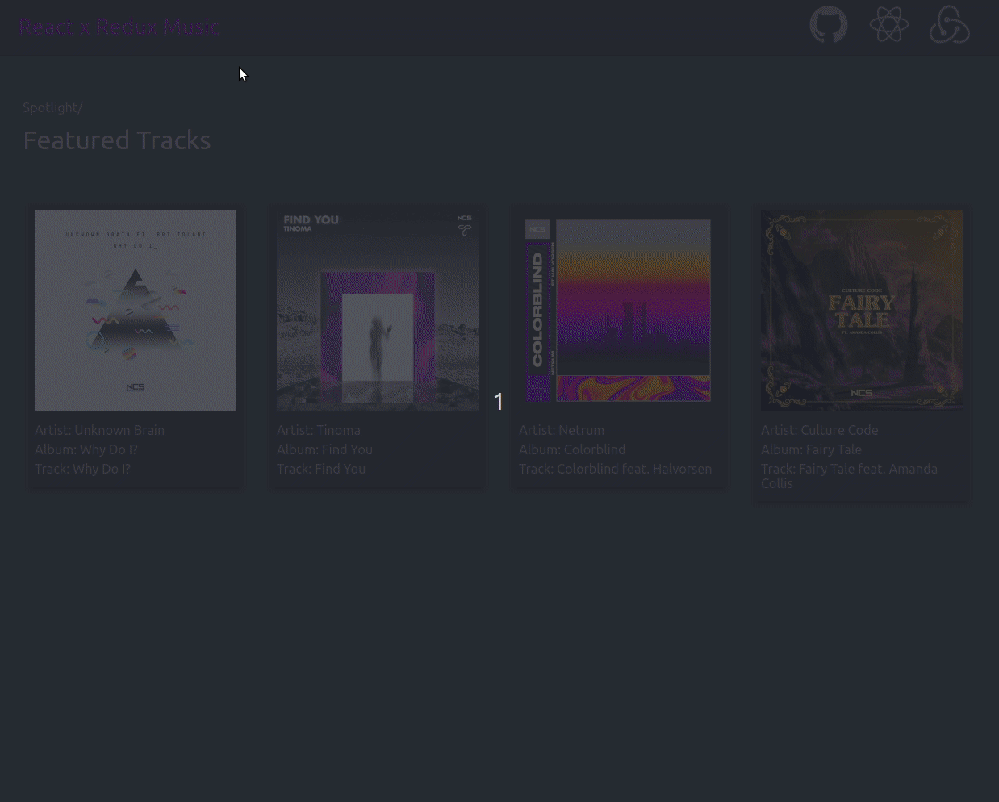
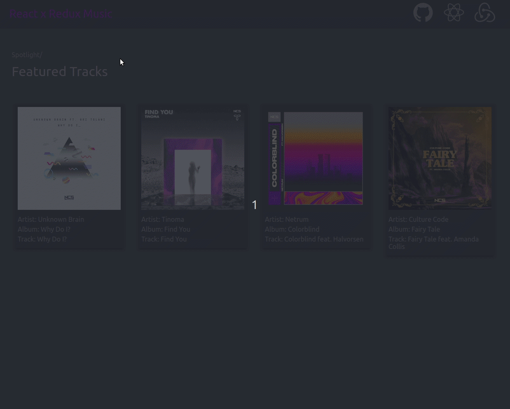
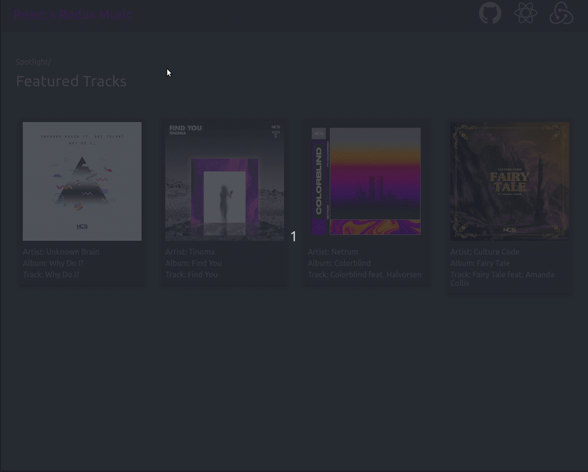

# React x Redux Music

This application is meant to have an integrated music library and utilize the mp3 files in the library to play the songs and provide a music player-like experience.

# Features

### Pop up cards when hovered over. ###

### Click to play. ###

### Music Player features such as play/pause, skip track, previous track. ###

### Audio Scrubber and Volume Slider. ###

